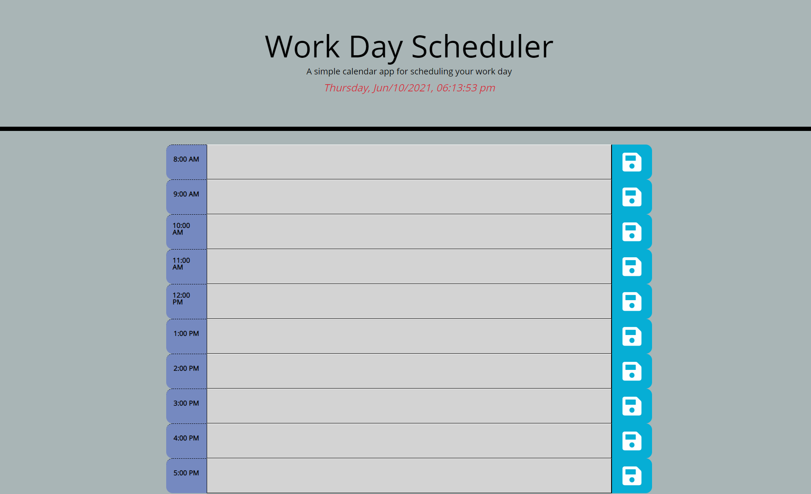

# Work Day Scheduler by Vlupascu

As a JQuerry challenge, I created this Application.

## Description:
The Work Day Scheduler App is designed to help scheduling events through out normal bussiness hours day.

## Features:
* User can add events(things to do) by simply clicking on container next to the desired hour;
* To save the event to the local Storage, click on the save button, on the far right side of each hour line;
    Note: By clicking anywhere on the page after entering an event, will simply save the data to the current session, thus the event will not get saved upon refreshing the page;
* Upon closing and re-opening the page, all Saved events will render to the schedule;
* For User's convinience, the App includes a current date and time in the header;
* The App automatically checks the User's time and adjusts the color of each hour line for added aid in prioritizing the events;
* When the event becomes past-due, it becomes disabled( unable to add, change or remove the content);
* The App will auto-refresh every 15 mins, in case the User keeps the App open at all times;
* At the end of the Bussiness Day, all events will be cleared to allow a fresh start for next day;
 
 ### Links:
* Live page: https://vitokwolf.github.io/Day-scheduler-VL/
* GitHub repo: https://github.com/vitokwolf/Day-scheduler-VL

